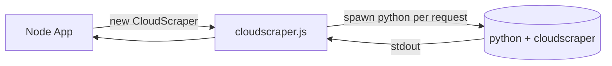
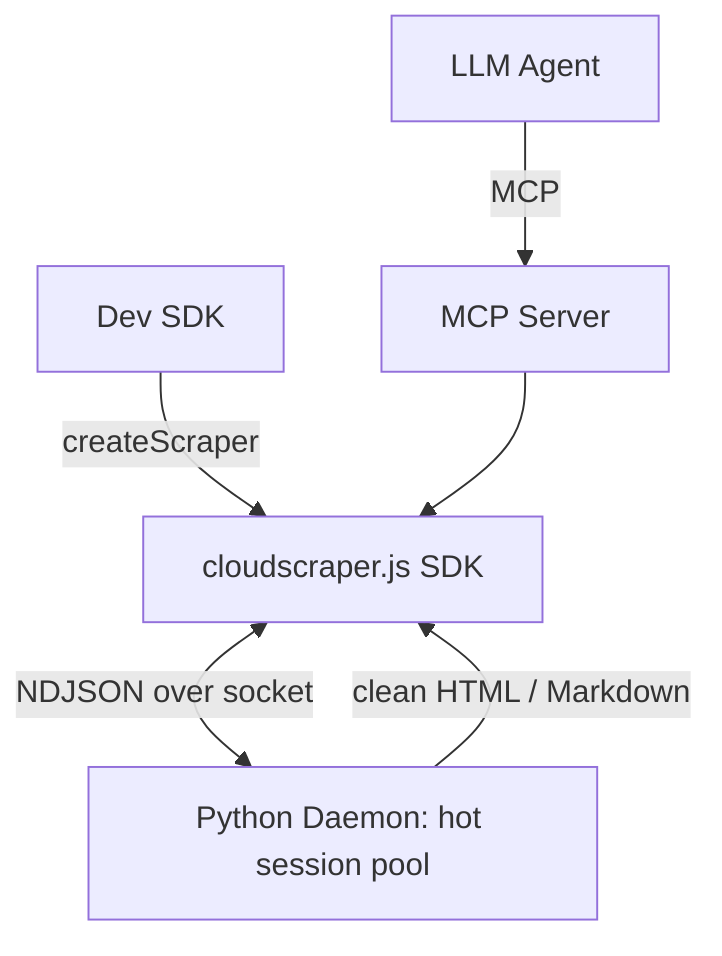

# CloudScraper.js

[](https://github.com/maarkN/cloudscraper.js/actions/workflows/ci.yml)


A Node.js wrapper for Python-based CloudFlare bypass functionality. This library is a JavaScript port of the popular `cloudscraper` Python library, designed to help developers bypass CloudFlare protection mechanisms in their Node.js applications.

## 🎯 Purpose

CloudScraper.js provides a seamless way to make HTTP requests to websites protected by CloudFlare, handling JavaScript challenges, CAPTCHAs, and other protection mechanisms automatically. It's particularly useful for:

- Web scraping applications
- API integrations with CloudFlare-protected endpoints
- Automated testing of protected websites
- Data collection from sites with anti-bot protection

## 🚀 Features

- **Automatic CloudFlare bypass**: Handles JavaScript challenges and CAPTCHAs
- **Multi-platform support**: Works on macOS, Linux, and Windows
- **Safe, explicit setup**: no privileged or automatic scripts run on `npm install`
- **Optional install helper**: `npm run install-deps` sets up Python + a venv when you want it
- **TypeScript support**: Full type definitions included
- **Multiple HTTP methods**: GET, POST, COOKIE, and TOKENS support

## 📦 Installation

This library requires **Node.js** and **Python 3** (with the `cloudscraper` package).

### Quick Start

```bash
npm install cloudscraper.js
# Install the Python side (opt-in — nothing privileged runs on `npm install`):
pip install cloudscraper          # or: pip install --break-system-packages cloudscraper
```

> **Why opt-in?** Earlier versions auto-installed Python on `postinstall` (including `sudo` /
> Homebrew / `curl | bash`). That was removed for safety — installing system packages is now an
> explicit choice, which keeps the package usable in CI, Docker and locked-down environments.
> If you'd like the guided helper (detects Python, creates a venv, installs `cloudscraper`), run:
>
> ```bash
> npm run install-deps
> ```

If the `cloudscraper` Python package is missing at runtime, the library fails fast with a clear
message telling you how to install it. See [INSTALLATION.md](./INSTALLATION.md) for details.

## 🔧 Usage

```javascript
// ES6
import CloudScraper from "cloudscraper.js";

// CommonJS
const CloudScraper = require("cloudscraper.js").default;

const scraper = new CloudScraper({
  usePython3: true, // Set to true if using python3, false for python
  timeoutInSeconds: 10,
});

// Simple GET request
scraper
  .get("https://example.com")
  .then((response) => {
    console.log("Status:", response.status);
    console.log("Data:", response.text());
  })
  .catch((error) => {
    console.error("Error:", error);
  });

// POST request with data
scraper
  .post("https://api.example.com", {
    headers: { "Content-Type": "application/json" },
    body: JSON.stringify({ key: "value" }),
  })
  .then((response) => {
    console.log(response.json());
  });
```

### Faster: reusable hot sessions (v0.2, experimental)

`createScraper()` talks to a long-lived daemon that keeps the solved Cloudflare
session **hot**, so repeated requests skip re-solving the challenge:

```ts
import { createScraper } from "cloudscraper.js";

const scraper = await createScraper({ retries: 3, rateLimitPerHost: 1 });

const first = await scraper.get("https://www.irishjobs.ie/");     // solves once
const again = await scraper.get("https://www.irishjobs.ie/jobs"); // reuses session (fast)

console.log(first.status, again.status);
await scraper.close();
```

Supports `get/post/put/delete/patch/head/cookies/tokens`, plus `proxy`, `retries`,
`rateLimitPerHost` and `timeoutMs`. Requires Python 3 + `pip install cloudscraper`.
This API is new in v0.2 and evolving.

## 🤖 Use it from an AI agent (v0.2)

Three ways for LLM agents to read anti-bot–protected pages, returning clean **markdown** by default.

**MCP server** — point any MCP client (Claude Desktop, IDEs) at the `cloudscraper-mcp` binary:

```json
{ "mcpServers": { "cloudscraper": { "command": "npx", "args": ["-y", "-p", "cloudscraper.js", "cloudscraper-mcp"] } } }
```

Tools: `fetch_protected_url`, `get_cookies`, `solve_challenge`.

**LangChain / LangGraph** (optional peer `@langchain/core`):

```ts
import { createScraper, createCloudScraperTool } from "cloudscraper.js";
const tool = await createCloudScraperTool(await createScraper({ format: "markdown" }));
// bind `tool` to your agent / graph
```

**Function calling** (OpenAI / Anthropic) — hand `functionSchemas` to the model, run the handler:

```ts
import { createScraper, fetchProtectedUrl, functionSchemas } from "cloudscraper.js";
const scraper = await createScraper();
const { text } = await fetchProtectedUrl(scraper, { url, format: "markdown" });
```

> The MCP server dynamically loads the ESM MCP SDK, so it needs **Node ≥ 22.12** plus Python 3 +
> `pip install cloudscraper`. See [`examples/`](./examples/).

## 🏗️ Architecture

Today the SDK spawns a short-lived Python process (running the `cloudscraper` library)
**per request** and reads the result back over stdout:



**v0.2 (in progress)** replaces the per-request spawn with a **long-lived daemon** that keeps
solved sessions hot (large speedup on repeated calls), a robust NDJSON IPC protocol, and
first-class **AI-agent interfaces** (an MCP server + a LangChain tool):



## 🛠️ Development Status

**⚠️ Early Development Phase**

This library is currently in early development. While functional, it may have limitations and breaking changes as we continue to improve it. We're actively working on:

- Enhanced error handling
- Better performance optimization
- Additional HTTP methods support
- Improved documentation
- More robust CloudFlare challenge handling

**We plan to release regular updates** to improve functionality and maintain compatibility with the latest CloudFlare protection mechanisms.

## 📚 Documentation

- [Installation Guide](./INSTALLATION.md) - Detailed setup instructions
- [API Reference](./docs/API.md) - Complete API documentation
- [Examples](./examples/) - Usage examples and patterns
- [Troubleshooting](./INSTALLATION.md#troubleshooting) - Common issues and solutions

## 🤝 Credits

This project is based on and inspired by:

- **[VeNoMouS&#39;s CloudScraper](https://github.com/VeNoMouS/cloudscraper)** - The original Python implementation
- **[cfbypass](https://github.com/VeNoMouS/cloudscraper)** - The Python library that powers this wrapper

All credit for the core CloudFlare bypass functionality goes to the original Python project and its contributors.

## 📄 License

ISC License - see [LICENSE](./LICENSE) file for details.

## 🐛 Issues & Contributions

Found a bug or have a feature request? Please open an issue on GitHub. Contributions are welcome!

## ⚠️ Disclaimer

This library is intended for legitimate use cases such as web scraping, testing, and API integration. Please ensure you comply with the terms of service of any websites you interact with and respect rate limits and robots.txt files.
